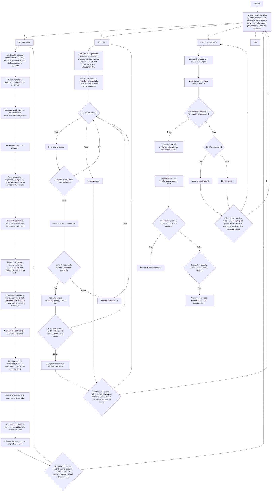

# Adelanto Proyecto Final

```mermaid
    flowchart TD;
    inicio[INICIO] --> seleccion[Escriba 1 para jugar sopa de letras, escriba 2 para jugar ahorcado, escriba 3 para jugar piedra papel o tijera o escriba 4 para salir del juego]
    seleccion --> |1| sopa[Sopa de letras]
    seleccion --> |2| ahorcado[Ahorcado]
    seleccion --> |3| piedra[Piedra, papel y tijera]
    seleccion --> |4| salir[FIN]
    ahorcado --> datos[Lista1 con 1000 palabras, Intentos = 7, Palabra a encontrar que sea aleatoria entre la Lista1, Crear Lista2 vacia para almacenar letras]
    datos --> ocultar[Con el caracter de _ , guión bajo, mostrarlo la cantidad de letras de la Palabra a encontar]
    ocultar --> bucle{Mientras Intentos > 0}
    bucle --> |True|pedir[Pedir letra al jugador]
    pedir --> condicion{Sí la letra ya está en la Lista2, entonces}
    condicion -->|True|bucle
    condicion -->|False|almacenar[Almacenar letra en la Lista2]
    almacenar -->está{Sí la letra está en la Palabra a encontrar, entonces}
    está -->|True|reemplazar[Reemplazar letra encontrada, por el _ , guión bajo]
    reemplazar -->guion{Sí se encuentran _ , guiones bajos, en la Palabra a encontrar, entonces}
    guion -->|True|bucle
    guion -->|False|ganaste[El jugador encontró la Palabra a encontrar]
    ganaste --> volver
    está -->|False|restarintentos[Intentos = Intentos - 1]
    restarintentos --> bucle
    bucle --> |False|perdio[jugador pierde]
    perdio -------> volver{Sí escribes 1 puedes volver a jugar el juego del ahorcado, Sí escribes 2 puedes salir al menú de juegos}
    volver -->|1|ahorcado
    volver -->|2|seleccion
    sopa --> solicitar[Solicitar al jugador un número de 10 a 30, para las dimensiones de la sopa de letras de forma cuadrada]
    solicitar --> pide[Pedir al jugador las palabras que desea incluir en la sopa]
    pide --> crea[Crear una matriz vacía con las dimensiones especificadas por el jugador]
    crea --> llena[Llenar la matriz con letras aleatorias]
    llena --> ingresada[Para cada palabra ingresada por el jugador, decidir aleatoriamente  la orientación de la palabra]
    ingresada --> selecciona[Para cada palabra se selecciona aleatoriamente una posición en la matriz]
    selecciona --> verifica[Verificar si es posible colocar la palabra sin superponer con otra palabra y sin salirse de la matriz]
    verifica --> coloca[Colocar la palabra en la matriz si es posible, de lo contrario vuelve a intentar con una nueva posición y orientación]
    coloca --> ver[Visualización de la sopa de letras en la consola]
    ver --> encontrada[Por cada palabra encontrada, el usuario ingresa la coordenada en terminos de i, j]
    encontrada --> coordenadas[Coordenada primer letra, coordenada última letra]
    coordenadas --> si[Sí lo anterior ocurreo, la palabra encontrada tendrá un cambio visual]
    si --> sisi[Sí lo anterior ocurre agrega un puntaje positivo]
    sisi --> volverr{Sí escribes 1 puedes volver a jugar el juego de la sopa de letras, Sí escribes 2 puedes salir al menú de juegos}
    volverr --> |1|sopa
    volverr --> |2|seleccion
    piedra --> datoss[Lista con tres palabras = piedra, papel, tijera]
    datoss --> vidas[vidas jugador = 3, vidas computador = 3]
    vidas --> bucless{Mientras vidas jugador > 0 and vidas computador > 0}
    bucless -->|True|computador[computador escoja aleatoriamente entre las palabras de la Lista]
    computador --> jugador[Pedir al jugador que escriba piedra, papel o tijera]
    jugador --> condiciones{Sí jugador = piedra y computador = piedra, entonces}
    condiciones -->|True|empate[Empate, nadie pierde vidas]
    condiciones -->|False|condiciones2{Sí jugador = papel y computador = piedra, entonces}
    condiciones2 -->|True|jugadorgana[Gana jugador, vidas computador = vidas computador - 1]
    bucless -->|False|sisisi{Sí vidas jugador = 0}
    sisisi --> |True|perdiste[La computadora ganó]
    sisisi --> |False|gana[El jugador ganó]
    perdiste --> volverrr{Sí escribes 1 puedes volver a jugar el juego de piedra papel y tijera, Sí escribes 2 puedes salir al menú de juegos}
    gana --> volverrr{Sí escribes 1 puedes volver a jugar el juego de piedra papel y tijera, Sí escribes 2 puedes salir al menú de juegos}
    volverrr --> |1|piedra
    volverrr --> |2|seleccion
```
