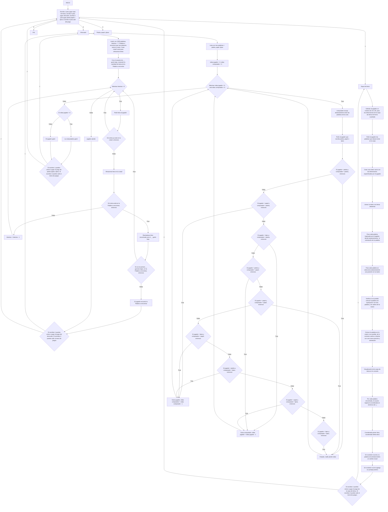

# 🔥 INDUSPLAYTHON - ADELANTO PROYECTO FINAL 🔥
## Logo IndusPlaython 👽

<figure>  
<figcaption><b></b></figcaption></figure>

### 🔥 Nuestra definición de alternativa fue unir 3 juegos en un salón de juegos, es decir, que el jugador cuando inicie el programa de python, podrá entrar a uno de los 3 juegos, que son el ahorcado, piedra, papel o tijera y sopa de letras.

### 🔥 En donde el juego iniciará dando una bienbenida, y dando una explicación corta de como funciona cada juego, para que luego el usuario seleccione el juego que quiera jugar.

### 🔥 En el juego del ahorcado el jugador podrá escoger la dificultad que desee, entre fácil, medio y difcil, entre más facil tendrá más intentos y las palabras serán más cortas. Funciona de tal manera en que hay 3 listas, cada lista por nivel de dificultad, con su hangman respectivo con número de intentos. Cuando el jugador elija el nivel de dificultad, el programa seleccione aleatoriamente una palabra de la lista, la cual expresa con guion bajo "_" el número de letras que tenga la palabra, es decir, si la palabra fuera gato sería _ _ _ _ . Entonces cuando ya se muestra la cantidad de guiones bajos el jugador escribirá las letras con las que intentará adivinar la palabra, esas letras se iran almacenando en otra lista, que funciona para que el jugador no repita las letras que ya ha escrito. Cuando acierta la letra, la letra pasa a estar en lugar del guión bajo. Cuando no acierta, se irá dibujando el hangman para la cantidad de intentos, según sea el nivel de dificultas seleccionado.
### 🔥 En la sopa de letras el jugador podrá escoger las dimensiones de la sopa de letras, siendo esta de forma cuadrada. Además escogerá las palabras que estarán escondidas en la sopa de letras. Según las dimensiones que haya dado el jugador, se creará una matriz vacia con esas dimensiones la cual se llenará con letras aleatorias, y las palabras escogidas por el jugador se pondrán organizadas de forma aleatoria. Ya que se pueda visualizar la sopa de letras, el jugador mediante coordenadas i , j encontrará las palabras, cuando encuentré una palabra, esta cambiará de aspecto visual.
### 🔥 En el juego de piedra papel o tijera, el jugador jugará contra la computadora. En una lista se colocan las 3 opciones, y la computadora escogerá aleatoriamente entre la lista. En el caso del jugador, el podrá escribir la opción que prefiera, y el juego mediante condiciones decidirá quien gana, siguiendo estas reglas: piedra aplasta tijera, tijera corta papel y papel envuelve piedra. El jugador como la computadora empezaran con 3 vidas, pierde el que se quede primero sin vidas.
### 🔥 Para cada juego luego de que termina, el jugador tendrá la opción de devolverse al menú para escoger de nuevo algún juego o salirse del salón de juegos (cerrar programa de python) o si quiere puede volver a iniciar el juego que estaba jugando.

