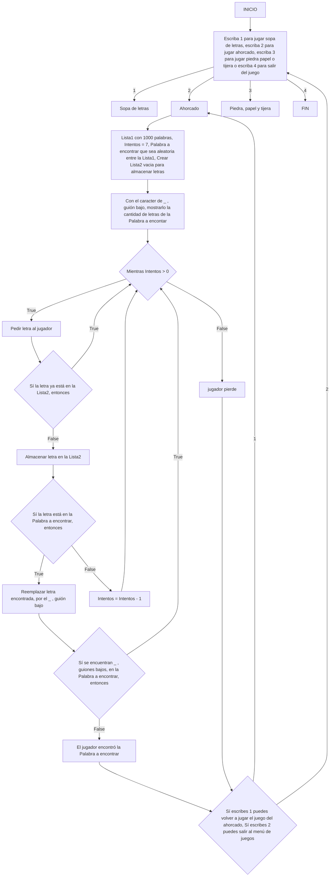

# Adelanto Proyecto Final

```mermaid
    flowchart TD;
    inicio[INICIO] --> seleccion[Escriba 1 para jugar sopa de letras, escriba 2 para jugar ahorcado, escriba 3 para jugar piedra papel o tijera o escriba 4 para salir del juego]
    seleccion --> |1| sopa[Sopa de letras]
    seleccion --> |2| ahorcado[Ahorcado]
    seleccion --> |3| piedra[Piedra, papel y tijera]
    seleccion --> |4| salir[FIN]
    ahorcado --> datos[Lista1 con 1000 palabras, Intentos = 7, Palabra a encontrar que sea aleatoria entre la Lista1, Crear Lista2 vacia para almacenar letras]
    datos --> ocultar[Con el caracter de _ , guión bajo, mostrarlo la cantidad de letras de la Palabra a encontar]
    ocultar --> bucle{Mientras Intentos > 0}
    bucle --> |True|pedir[Pedir letra al jugador]
    pedir --> condicion{Sí la letra ya está en la Lista2, entonces}
    condicion -->|True|bucle
    condicion -->|False|almacenar[Almacenar letra en la Lista2]
    almacenar -->está{Sí la letra está en la Palabra a encontrar, entonces}
    está -->|True|reemplazar[Reemplazar letra encontrada, por el _ , guión bajo]
    reemplazar -->guion{Sí se encuentran _ , guiones bajos, en la Palabra a encontrar, entonces}
    guion -->|True|bucle
    guion -->|False|ganaste[El jugador encontró la Palabra a encontrar]
    ganaste --> volver
    está -->|False|restarintentos[Intentos = Intentos - 1]
    restarintentos --> bucle
    bucle --> |False|perdio[jugador pierde]
    perdio -------> volver{Sí escribes 1 puedes volver a jugar el juego del ahorcado, Sí escribes 2 puedes salir al menú de juegos}
    volver -->|1|ahorcado
    volver -->|2|seleccion
```
